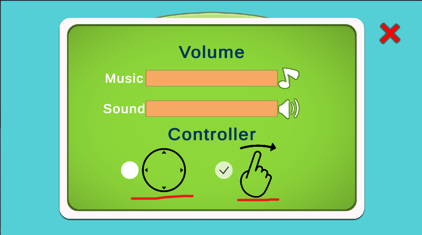
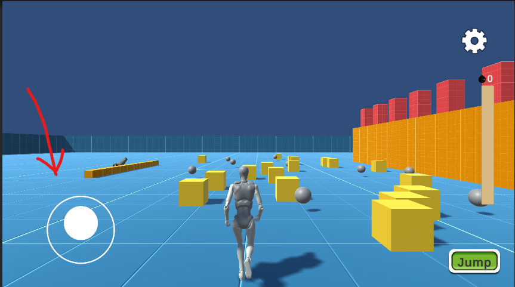
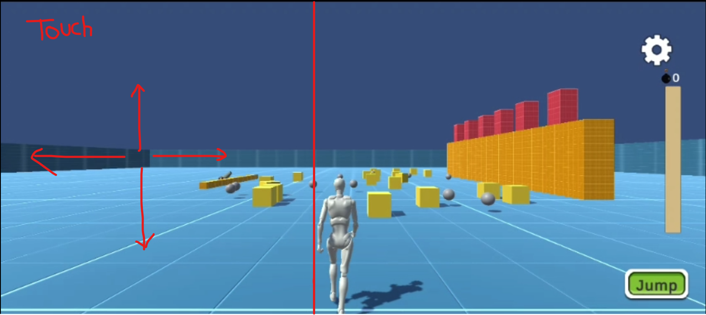
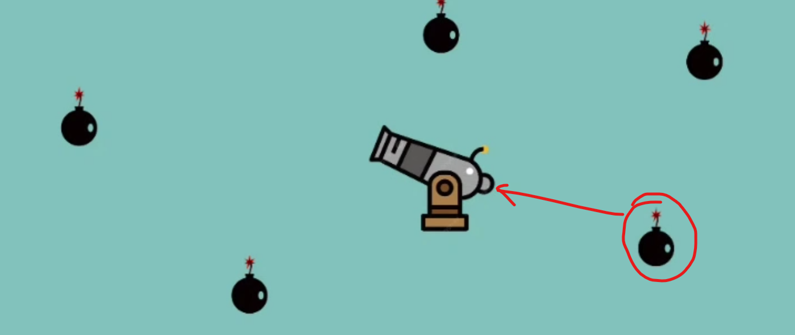
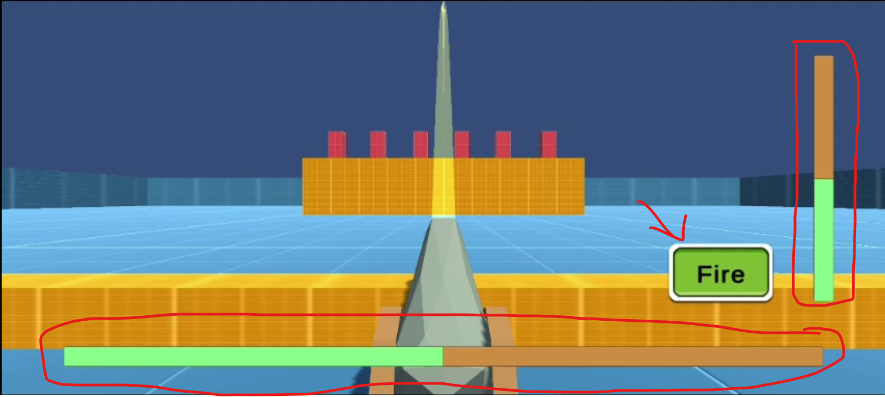

# CannonFire

---

A prototype game called Cannon Fire has an interactive user interface, player controllers that work with swipe gestures, blend animation for player movements, and cannon machines that shoot cannonballs.

---
### Download And Play

Cannon Fire is designed and built for Android devices. You can download the build by clicking on this link [Download Link](https://github.com/Anoop114/CannonGame/releases/download/AndroidBuild/CannonFire.apk) or by visiting the [Build Page](https://github.com/Anoop114/CannonGame/releases/tag/AndroidBuild).

---

### Tools (Asset use)
1. The Unity asset store's standard asset.
2. Get the Canon Model for free via the internet.
3. For UI animation, use DoTween.
4. A few web sources for projectiles, etc.

---

### How to Play

1. To move the player left, right, forward, and backward, use the left side of the screen.
   - This game features 2 input controller
   
     - A. Joystick Controller
     
     - B. Swipe Controller
     
2. Collect 5 cannon balls to proceed further.
3. To load the cannon machine, simply get close to it once you have five cannon balls.

4. Now you must hit any three targets in front of the cannon machine to win the game.

---

### Game Play Video

- With Swipe Controller
  
https://github.com/Anoop114/CannonGame/assets/69163049/56f0a16b-a45b-4f5f-bf7b-8149f597f956

- With Joystick Controller

https://github.com/Anoop114/CannonGame/assets/69163049/17dc06a0-917d-4591-b172-2f046903af2c

Hope you enjoy it.
